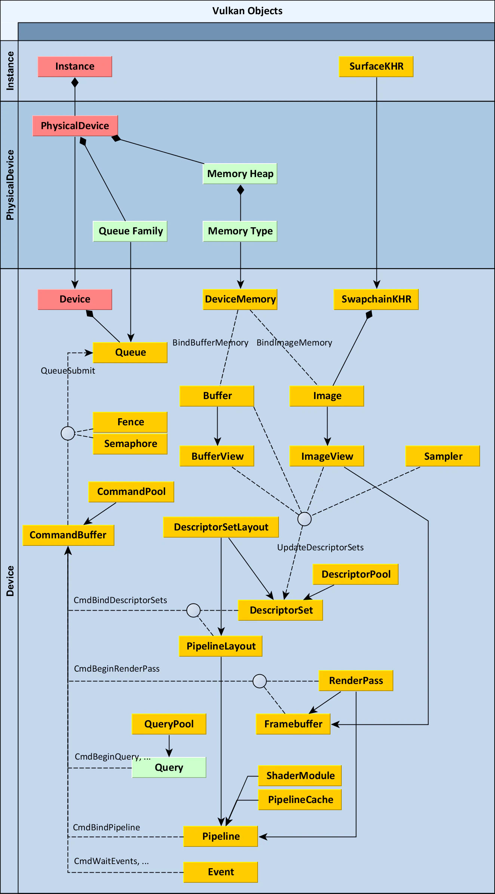

# M1kanN Vulkan Renderer Engine

This little engine is used to learn **Vulkan** and reproduce some CG algorithms.

## TODO
- Basic Functions
  `viewer.data`: store the viewer data and other options to handle some showcases (i.e. lines, points, label, etc.)
  `viewer.data.set_data(V, F)` etc functions to set mesh, set shaders.

## References

* **Websites:**

  * [Vulkan Documentation :: Vulkan Documentation Project](https://docs.vulkan.org/spec/latest/index.html)
  * [Learn OpenGL, extensive tutorial resource for learning Modern OpenGL](https://learnopengl.com/)

  - [Introduction - Vulkan Tutorial (vulkan-tutorial.com)](https://vulkan-tutorial.com/Introduction)
  - [Great resources - Vulkan Guide (vkguide.dev)](https://vkguide.dev/docs/great_resources)
  - [Physically Based Rendering in Filament (google.github.io)](https://google.github.io/filament/Filament.html)
  - [zeux.io - Writing an efficient Vulkan renderer](https://zeux.io/2020/02/27/writing-an-efficient-vulkan-renderer/)

- **Videos:**
  * [Vulkan Lecture Series: Computer Graphics at TU Wien](https://youtube.com/playlist?list=PLmIqTlJ6KsE1Jx5HV4sd2jOe3V1KMHHgn&si=-NMD7VzsJ1j2XeWx)
  * [Vulkan (c++) Game Engine Tutorials](https://youtube.com/playlist?list=PL8327DO66nu9qYVKLDmdLW_84-yE4auCR&si=H_bkhMgSvbs3Dfsm)
- **Repositories:**
  * [KhronosGroup/Vulkan-Samples: One stop solution for all Vulkan samples (github.com)](https://github.com/KhronosGroup/Vulkan-Samples)
  * [NVIDIA DesignWorks Samples (github.com)](https://github.com/nvpro-samples)
  * [SaschaWillems/Vulkan: Examples and demos for the new Vulkan API (github.com)](https://github.com/SaschaWillems/Vulkan)
  * [David-DiGioia/vulkan-diagrams: Diagrams showing relationships between Vulkan objects and how they're used. (github.com)](https://github.com/David-DiGioia/vulkan-diagrams)

## Diagram

